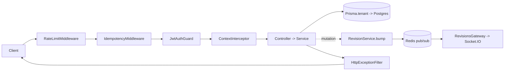

# Aqademiq Backend — Architecture & Reference

> Auto-generated codebase reference. High-level architecture plus low-level
> module details for onboarding and future work. Grounded in the code under
> `aqademiq-backend/src` and `aqademiq-backend/prisma`.

## 1. Overview

- **Purpose:** REST + WebSocket backend for **Aqademiq**, a student
  study/productivity app (Flutter client). Owns auth, tasks with a recurring
  engine, subjects/semesters, focus sessions, mood tracking, streaks, an
  AI assistant ("Ada"), notifications, offline sync, and a realtime
  invalidation stream. Every row is scoped to a single user (multi-tenant by
  `user_id`).
- **Tech stack:**
  - **Runtime:** Node.js 20, TypeScript 5.5
  - **Framework:** NestJS 10 (`@nestjs/*`) on Express (`@nestjs/platform-express`)
  - **DB:** PostgreSQL via **Prisma 5** (`@prisma/client`)
  - **Cache/queue/pubsub:** Redis via `ioredis` + **BullMQ**
  - **Auth:** custom RS256 JWT via `jose`, passwords via `argon2`
  - **AI:** Claude via Anthropic API or Vertex AI (`@anthropic-ai/sdk`, `@anthropic-ai/vertex-sdk`)
  - **Storage:** Google Cloud Storage (`@google-cloud/storage`)
  - **Push:** FCM via `firebase-admin` (APNs stubbed)
  - **Realtime:** Socket.IO (`@nestjs/platform-socket.io`, `@nestjs/websockets`)
  - **Scheduling:** `@nestjs/schedule` cron; recurrence math via custom engine (`luxon`, `rrule` available)
  - **API docs:** Swagger (`@nestjs/swagger`) at `/docs`
- **Repository layout (top level):**
  - `aqademiq-backend/` — the NestJS service (all application code)
  - `reference_docs/` — spec, schema notes, walkthroughs, frontend request maps
  - `terminals/`, `mcps/`, `agent-transcripts/` — tooling/workspace metadata (not app code)

### Repository layout inside `aqademiq-backend/`

```
src/
  main.ts            # bootstrap: /v1 prefix, CORS, ValidationPipe, Swagger
  app.module.ts      # all feature modules + global providers + middleware wiring
  common/            # guards, interceptors, middleware, filters, RequestContext
  infra/             # shared singletons: Prisma, Redis, Token, Claude, Storage, Queue, Push, Revision
  features/          # one module per domain (23 controllers)
prisma/
  schema.prisma      # ~27-model data model (snake_case via @map)
scripts/             # gen-keys.sh (RS256 keypair), gen-modules.js
terraform/main.tf    # GCP infra (Cloud SQL/Redis/Run/buckets)
docs/                # this file
```

## 2. Getting Started

Commands (from `package.json` / `CLAUDE.md`):

```bash
npm install
docker compose up -d          # Postgres + Redis (local)
cp .env.example .env          # fill DATABASE_URL, REDIS_*; AI/GCS/FCM optional
npm run keys:gen              # generate RS256 keypair into keys/ (once)
npx prisma migrate dev        # create schema in your Postgres
npm run start:dev             # dev server (http://localhost:8080), all /v1 routes
```

Verify: `curl localhost:8080/v1/healthz` → `{"status":"ok"}`

Other scripts: `npm run build` (compile, must pass before pushing), `npm run lint`,
`npm run test` (jest, `--passWithNoTests`), `npm run prisma:generate`,
`npm run prisma:migrate` (deploy migrations in prod). Emit the OpenAPI spec to
disk with `EMIT_OPENAPI=1 npm run start:dev` (writes `openapi.json`).

### Required env vars (`.env.example`)

| Group | Vars | Notes |
|---|---|---|
| Core | `NODE_ENV`, `PORT` (8080), `ENABLE_SQL_SMOKE_TEST` | |
| GCP | `GCP_PROJECT_ID`, `GCP_REGION` | region-pinned (EU/UAE) |
| Postgres | `DATABASE_URL` | required |
| Redis | `REDIS_HOST`, `REDIS_PORT`, `REDIS_AUTH_STRING`, `REDIS_CA_CERT_PATH` | required |
| Auth | `JWT_PRIVATE_KEY_PATH`, `JWT_PUBLIC_KEY_PATH`, `ACCESS_TTL_SECONDS` (900), `REFRESH_TTL_DAYS` (60) | RS256 keys |
| AI | `AI_PROVIDER`, `ANTHROPIC_API_KEY`, `GCP_PROJECT_ID`, `VERTEX_REGION`, `CLAUDE_OPUS_MODEL`, `CLAUDE_HAIKU_MODEL` | auto-detected if blank; optional |
| Storage | `GCS_USER_BUCKET`, `GCS_PRISM_CDN_BUCKET` | optional (files return 501 if unset) |
| SSO | `GOOGLE_OAUTH_CLIENT_IDS`, `APPLE_OAUTH_CLIENT_IDS` | comma-separated audiences |
| Email | `EMAIL_PROVIDER_API_KEY`, `EMAIL_FROM` | |
| Push | `FCM_SERVICE_ACCOUNT_PATH`, `APNS_KEY_PATH`, `APNS_KEY_ID`, `APNS_TEAM_ID` | FCM live, APNs stubbed |

> Feature flags: `REMINDERS_CRON=on` enables the per-minute reminder sweep (off
> by default); `ENABLE_SQL_SMOKE_TEST=1` enables the debug SQL endpoint.

## 3. High-Level Architecture

- **Style:** Modular monolith. A single NestJS app composes ~22 feature modules
  plus a global `InfraModule` of shared singletons. Designed to deploy on Cloud
  Run; horizontal scaling is stateless because all cross-instance coordination
  (rate limits, deny-list, idempotency, sync cursor, realtime fan-out) goes
  through Redis.
- **Wire contract:** All HTTP endpoints are under `/v1`, JSON is **snake_case**
  (DTO properties are literally written snake_case — NestJS does no case
  transform). `ValidationPipe` runs with `whitelist: true`,
  `forbidNonWhitelisted: true`, `transform: true`. Auth is
  `Authorization: Bearer <access_token>`.
- **Multi-tenancy:** Application-level row scoping. `PrismaService.tenant`
  auto-injects `user_id` (read from `RequestContext`) into every query on
  tenant-scoped models. Services use `prisma.tenant.*`; raw `prisma.*` is only
  for auth/system paths and the cron sweep.

### Request pipeline (every HTTP request)



Order (from `app.module.ts`): middleware (`RateLimitMiddleware`,
`IdempotencyMiddleware`) run first on all routes, then the global `JwtAuthGuard`,
then the `ContextInterceptor`, then the handler. `HttpExceptionFilter` normalizes
all errors. Note middleware runs **before** the guard, so idempotency scoping is
keyed by a hash of the bearer token, not `userId`.

### External integrations

| Integration | Client | Used for | Config-safe? |
|---|---|---|---|
| PostgreSQL | Prisma | primary datastore | required |
| Redis (Memorystore) | ioredis / BullMQ | cache, rate limit, JWT deny-list, idempotency, sync cursor, pub/sub, queues | required |
| Claude (Anthropic API or Vertex) | SDKs | Ada chat, task breakdown, week planning | yes — `provider='none'` fallback |
| Google Cloud Storage | `@google-cloud/storage` | presigned file upload/download, Prism CDN | yes — 501 if bucket unset |
| FCM | firebase-admin | push notifications | yes — no-op if unset |
| Google/Apple OAuth | (verification in auth service) | SSO sign-in | optional |

## 4. Module Reference

### `src/infra` — shared singletons (`@Global` `InfraModule`)

- **Responsibility:** Cross-cutting infrastructure available to every feature.
- **Key files:**
  - `prisma.service.ts` — `PrismaService extends PrismaClient`. The `.tenant`
    getter returns a `$extends` client that injects `user_id` into
    `find*/update*/delete*/count/aggregate` where-clauses and into `create`
    data, for models in `TENANT_MODELS` (User, UserProfile, Semester, Subject,
    SubjectFile, TaskSeries, MoodEntry, StudyTag, ActivityEvent, FocusSession,
    AdaConversation, Device).
  - `token.service.ts` — `TokenService`. Mints/rotates/verifies tokens. Access =
    short-lived RS256 JWT (claims `sub`, `sid`, `is_guest`). Refresh = opaque
    `{sid}.{secret}`; secret stored SHA-256-hashed in `user_sessions`.
    Revocation is instant via Redis deny-list `auth:deny:{sid}`. Includes
    refresh-reuse detection (revoked token replayed → kill all user sessions).
  - `redis.service.ts` — `RedisService`. Shared `ioredis` client with AUTH/TLS,
    reconnect strategy, and swallowed error events (features fail open).
  - `claude.service.ts` — `ClaudeService`. Provider auto-detect
    (`anthropic` | `vertex` | `none`). `createMessage()` for Ada (Opus),
    `breakdownSteps()` for task microsteps via a forced Haiku tool call.
  - `storage.service.ts` — `StorageService`. GCS v4 presigned upload/download
    URLs (5-min TTL), user-namespaced quarantine keys, staging + Ada-attachment
    key builders. `isConfigured()` gates the files feature.
  - `queue.service.ts` — `QueueService`. Three BullMQ queues: `reminders`,
    `ai-jobs`, `email`.
  - `push.service.ts` — `PushService`. `send()` routes by provider; FCM
    implemented, APNs returns `unsupported_provider`.
  - `revision.service.ts` — `RevisionService`. `bump(userId)` increments
    `sync:rev:{userId}` and publishes to `revisions:{userId}`; `current()` reads
    the counter (the sync cursor).

### `src/common` — request pipeline primitives

- **Responsibility:** Guards, interceptor, middleware, filter, request context.
- **Key files:**
  - `request-context.ts` — `RequestContext`, an `AsyncLocalStorage` holding
    `{ userId, isGuest }` for the request lifetime; services read `rc.userId`.
  - `guards/jwt-auth.guard.ts` — `JwtAuthGuard` (global). Verifies bearer token
    via `TokenService.verifyAccess`, attaches `userId/isGuest/sessionId` to the
    request. `@Public()` decorator bypasses it.
  - `interceptors/context.interceptor.ts` — populates `RequestContext` from the
    authed request.
  - `middleware/rate-limit.middleware.ts` — Redis fixed-window per-IP limit
    (20/min on `/auth/*`, 200/min otherwise; fails open, 150ms Redis timeout).
  - `middleware/idempotency.middleware.ts` — replays cached 2xx responses for
    mutating requests carrying `Idempotency-Key` (24h TTL, scoped by token hash).
  - `filters/http-exception.filter.ts` — uniform snake_case error body
    (`status_code`, `error`, `message`, optional `errors`, `path`, `timestamp`).

### `src/features/*` — domain modules

Each module has a `*.module.ts`, `*.controller.ts`, `*.service.ts`, and usually a
`dto/*.dto.ts`. Service bodies are partially stubbed (`TODO(§x)` markers). Base
routes below are all under the global `/v1` prefix.

| Module | Base route(s) | Responsibility |
|---|---|---|
| `auth` | `/auth` | guest/signup/OTP/signin/refresh, SSO, sessions, password & email change, account delete |
| `onboarding` | `/onboarding` | post-registration setup (`complete`) |
| `tasks` | `/tasks` | task series CRUD, occurrence toggle/move/patch/delete, breakdown, completion history |
| `subjects` | `/subjects` | subject CRUD, reorder, file attach/scan |
| `semesters` | `/semesters` | semester CRUD, active selection |
| `files` | `/uploads`, `/files` (root) | presigned upload init/commit, download, thumbnail, patch, delete |
| `focus` | `/focus-sessions` | start/checkpoint/complete focus sessions |
| `ada` | `/ada` | AI conversations, messages, apply-plan, plan-week, uploads |
| `mood` | `/mood-entries` | daily mood log, reflection, week/today/day reads |
| `streaks` | `/streaks` + root activity routes | current streak; `activity-dates`, `week-count`, `today-has-activity` |
| `profile` | `/profile`, `/me/stats` | profile get/update, aggregated stats |
| `settings` | `/me` | settings, email/notification prefs, notification channels, data export |
| `tags` | `/study-tags` | study tag list/create/delete |
| `notifications` | `/me/notifications` | history, inbox, test, manual sweep |
| `devices` | `/devices` | push device register/update/heartbeat/delete |
| `referrals` | `/referrals` | redeem code, reward balance |
| `integrations` | `/integrations` | ICS import, Google Calendar OAuth (stubs) |
| `feedback` | `/ratings`, `/feedback`, `/telemetry/events` (root) | ratings, feedback, telemetry |
| `prism` | `/prism-modes` | focus soundscape catalog (CDN URLs) |
| `sync` | `/sync` | offline delta (`changes`, `mutations`, `cursor`) |
| `realtime` | WS `/me/revisions` | Socket.IO revision stream (see §5) |
| `health` | `/healthz`, `/readyz`, `/metrics`, `/debug/sql-smoke-test` | ops/liveness/readiness |

Notable service logic:
- `tasks/occurs-on.ts` — pure, dependency-free recurrence engine. `occursOn(series, date)`
  answers "does this series occur on this date?" at **UTC day precision** (DST-safe).
  Supports `none|daily|weekdays|weekly|monthly|everyNDays|everyNWeeks|everyNMonths`;
  monthly clamps day-of-month to the last day of the month. Occurrences are never
  pre-expanded — materialized lazily. Occurrence ids are `{series_id}@{yyyy-MM-dd}`
  (`occurrenceId` / `parseOccurrenceId`). Covered by `occurs-on.spec.ts`.
- `notifications/reminders.service.ts` — `@Cron(EVERY_MINUTE)` sweep (gated by
  `REMINDERS_CRON=on`). Resolves each active device's local wall-clock time
  against user settings and enqueues due reminders to BullMQ. Uses raw `prisma.*`
  (runs outside a request).
- `notifications/reminder.worker.ts` — BullMQ `reminders` worker. Dedups via the
  `NotificationLog.idempotency_key` UNIQUE constraint (`P2002` → no-op), then
  delivers through `PushService`.

## 5. Entry Points & Flows

- **Bootstrap:** `src/main.ts` → creates the Nest app, sets `/v1` prefix, enables
  CORS, installs the strict `ValidationPipe`, mounts Swagger at `/docs`
  (`/docs-json` for the OpenAPI spec), enables shutdown hooks, listens on
  `PORT` (default 8080).
- **HTTP routes:** declared per feature controller (§4 table). Static routes are
  intentionally declared before dynamic `:param` routes to avoid shadowing
  (e.g. `tasks/history/completions` before `:occ`, `subjects/reorder` before `:id`).
- **WebSocket:** `RevisionsGateway` (`@WebSocketGateway({ namespace: '/me/revisions' })`).
  Client authenticates with its access token on the handshake (`auth.token`,
  `query.token`, or `Authorization` header) and joins room `user:{id}`. A
  dedicated Redis subscriber `psubscribe('revisions:*')` relays pub/sub messages
  to the matching room — works across Cloud Run instances.
- **Scheduled jobs:** `RemindersService.cronSweep` (per minute, env-gated);
  `ReminderWorker` BullMQ consumer.

### Representative flow: authenticate → create a task → realtime invalidation

1. `POST /v1/auth/guest` (or `signin`) → `AuthService` → `TokenService.mintSession`
   creates a `user_sessions` row and returns `{ access_token, refresh_token, ... }`.
2. Client calls `POST /v1/tasks` with `Authorization: Bearer <access_token>`.
   Rate-limit + idempotency middleware pass → `JwtAuthGuard.verifyAccess`
   (RS256 + deny-list check) attaches `userId` → `ContextInterceptor` populates
   `RequestContext`.
3. `TasksController.create` → `TasksService` uses `prisma.tenant.taskSeries.create`
   (auto-injects `user_id`) → on success calls `RevisionService.bump(userId, 'task')`.
4. `bump` increments `sync:rev:{userId}` and publishes to `revisions:{userId}`;
   `RevisionsGateway` pushes a `revision` event to the client's `user:{id}` room,
   which triggers a `GET /v1/sync/changes?since=<cursor>` refetch.

### Representative flow: Ada apply-plan (AI safety gate §4.3)

Ada proposes a plan (`POST /v1/ada/conversations/:id/messages`, Claude Opus with
tools). No raw LLM output mutates data — the user confirms and the server
validates every field before persisting via
`POST /v1/ada/conversations/:cid/messages/:mid/apply-plan`.

## 6. Cross-Cutting Concerns

- **Configuration:** `@nestjs/config` global; all runtime config via env
  (see §2). Secrets (RS256 keys, service accounts) mounted from files/Secret
  Manager.
- **Auth & tenancy:** RS256 JWT access + opaque refresh; Redis deny-list for
  instant revocation; `RequestContext` + `PrismaService.tenant` enforce
  per-user row scoping. Passwords hashed with argon2; refresh secrets SHA-256.
- **Idempotency & rate limiting:** Redis-backed middleware, both fail open on
  Redis hiccups (availability over strictness).
- **Error handling:** single `HttpExceptionFilter` → uniform snake_case body;
  5xx are logged with stack.
- **Logging:** `nestjs-pino` available; `Logger` used in the exception filter.
- **Persistence:** Prisma + Postgres; `@map` gives snake_case tables. Soft
  deletes via `deleted_at` on several models.
- **Realtime & sync:** Redis pub/sub + monotonic per-user revision counter;
  Socket.IO for push, `/v1/sync/changes` for pull.
- **Testing:** jest; the key covered unit is the recurrence engine
  (`occurs-on.spec.ts`).
- **Ops:** `/healthz` (liveness), `/readyz` (DB+Redis, 503 gating),
  `/metrics` (Prometheus text).

### Deployment (Cloud Run CI/CD)

- **Container:** multi-stage `Dockerfile` (`node:20-bullseye-slim`) → `npm ci` +
  `prisma generate` + `npm run build`, runtime image runs `node dist/main.js` on
  port **8080**. `docker-compose.yml` is **local dev only** (Postgres + Redis).
- **Pipeline:** `.github/workflows/deploy.yml` runs on every push to `main`
  (keyless GCP auth via Workload Identity Federation). Steps: Prisma
  `migrate deploy` through the Cloud SQL Auth Proxy (with P3005 baseline
  fallback) → `gcloud builds submit` image to Artifact Registry →
  `gcloud run deploy --allow-unauthenticated --port 8080` → verify
  `GET /v1/healthz` returns `{"status":"ok"}`. PRs run CI only (build + prisma
  validate + OpenAPI artifact); no separate staging environment.
- **Infra (`terraform/main.tf`):** Cloud SQL Postgres 16 (regional HA, private
  IP), Memorystore Redis 7 (`STANDARD_HA`, `auth_enabled=true`), private user
  bucket + public Prism CDN bucket, VPC + serverless connector, Cloud Run
  service (min 1 / max 20 instances).
- **Fixed coordinates:** project `aqademiqbackendv1`, region `europe-west1`,
  service `aqademiq-backend`. Live URL form
  `https://aqademiq-backend-<PROJECT_NUMBER>.europe-west1.run.app` (not committed;
  fetch via `gcloud run services describe`).
- **⚠️ Partial prod config:** the deploy injects only `DATABASE_URL` + JWT keys
  (Secret Manager) and `REDIS_HOST/REDIS_PORT` + base env vars. It does **not**
  set `GCS_*`, AI, `EMAIL_*`, FCM/APNs, or `REDIS_AUTH_STRING` — so on the live
  service those integrations degrade to their unconfigured behavior (files 501,
  AI `provider='none'`, push no-op), and Redis auth is a known gap vs the
  Terraform `auth_enabled=true` setting.

## 7. Conventions & Gotchas

- **snake_case everywhere on the wire.** DTOs declare snake_case properties
  directly; do not rely on serializer case transforms.
- **Always use `prisma.tenant.*` in feature services.** Raw `prisma.*` is only
  correct in `auth`, health, and the cron sweep (which runs outside a request
  and has no `RequestContext`).
- **Declare static routes before dynamic `:param` routes** in controllers.
- **Occurrence ids are `{series_id}@{yyyy-MM-dd}`** and recurrence math is
  UTC-day precision — keep the engine pure and DST-safe.
- **Config-safe optional integrations:** Claude/GCS/FCM degrade gracefully when
  env is unset (`provider='none'`, files 501, push no-op) — safe to run locally
  without them.
- **Middleware runs before the guard**, so idempotency is scoped by token hash,
  not `userId`.
- **Implementation state:** the scaffold compiles end-to-end; many service
  bodies are stubs marked `TODO(§x)` pointing back to `BACKEND_REQUIREMENTS.md`
  spec sections. Suggested fill order: `auth` → `tasks` (recurring engine) →
  `subjects`/`semesters` → `mood`/`streaks` → `sync` → `ada`.

## 8. Open Questions

- **`BACKEND_REQUIREMENTS.md`** (the authoritative spec referenced by every
  `TODO(§x)` and README) was not located in the workspace during this mapping —
  section numbers here are transcribed from in-code references, not verified
  against the source spec.
- **APNs push** is not wired (needs an HTTP/2 APNs client dependency).
- **Prisma models vs `TENANT_MODELS`:** several models (e.g. `AdaMessage`,
  `OccurrenceOverride`, `TaskStep`, `NotificationLog`, `SettingsPrefs`,
  `EmailPreferences`, `NotificationChannelPref`, `Referral`) are **not** in the
  tenant auto-scope set and rely on being reached through a scoped parent or raw
  queries — worth confirming each access path is correctly user-scoped.
- Exact request/response DTO shapes per endpoint are defined in each
  `features/*/dto/*.dto.ts`; a dedicated endpoint contract doc (for the frontend
  handoff) is a separate deliverable (see note below).
```
